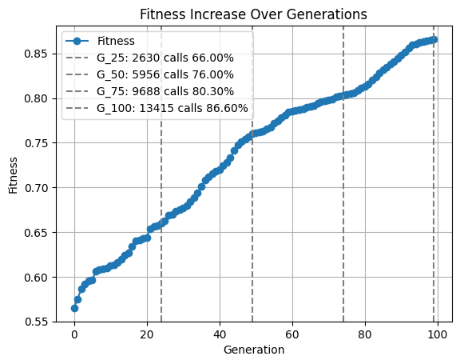
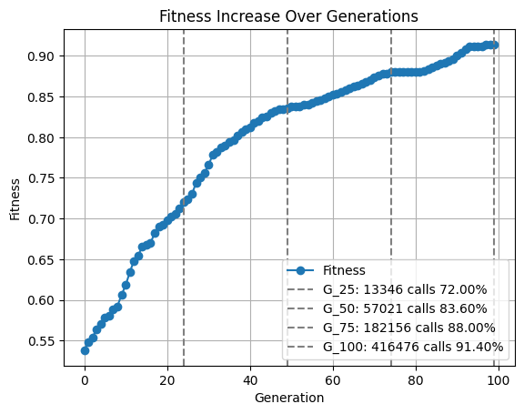
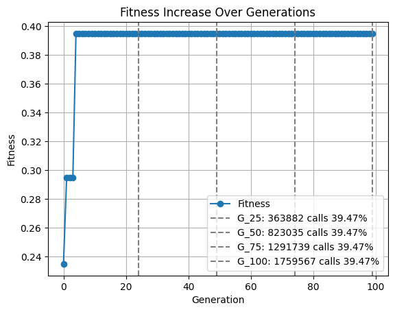

# Genetic Algorithm for Optimization

This code implements a genetic algorithm to solve optimization problems, focusing on different instances of a problem characterized by constants defined in the variables `A`.

## Results

### Problem = 1

### Problem = 2

### Problem = 5

### Problem = 10

## Purpose
The main objective is to maximize the fitness of individuals in a population across generations through mutation and crossover operations. The code aims to find optimal solutions to different instances of a problem characterized by values in the variable `A`.

## Key Components and Operations
- **Initialization**: Sets up islands as separate populations and initializes genomes with random binary values.
- **Fitness Evaluation**: Utilizes a fitness function provided in `lab9_lib.make_problem(a)` to evaluate the fitness of individuals in the population.
- **Mutation**: Implements a mutation function, `mutate_genome`, to randomly alter individual genomes based on a given mutation rate.
- **Crossover**: Performs crossover operations between selected individuals to generate new genomes.
- **Selection**: Selects the top individuals based on their fitness to form the next generation.
- **Plotting**: Visualizes the fitness increase over generations and tracks fitness function calls at specific generations.

## Code Structure
- **Variables**:
  - `number_of_islands`: Number of separate populations (islands).
  - `starting_population`: Initial population size.
  - `bests`: Number of top individuals selected from each island.
  - `generations`: Number of generations for the genetic algorithm.
  - `loci`: Number of loci in each genome.
  - `steps`: Different step values for crossover.
  - `A`: Values representing different instances of the problem.

## Running the Code
The code generates plots showing the increase in fitness over generations for each problem instance represented by values in `A`. The fitness function calls at specific generations are also visualized.

## Dependencies
- `matplotlib` for plotting graphs.
- `lab9_lib` module for problem-specific functions.

## Usage
Ensure that the `lab9_lib` module is available and the problem-specific functions are correctly implemented before running this code.
